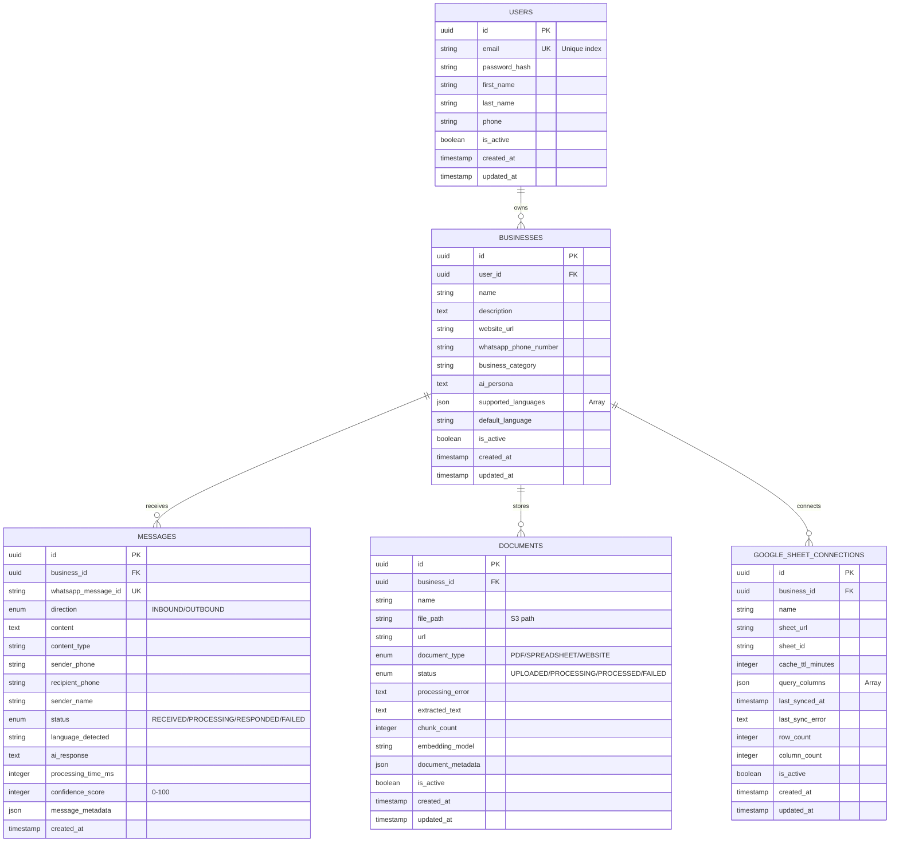

# WhatsApp AI SaaS - Complete Architecture Flow Diagram

## 1. Complete System Architecture

## 2. Detailed Message Flow - Inbound WhatsApp Message

## 3. Document Upload and Processing Flow

## 4. Authentication Flow

## 5. Database Schema Relationships

## 6. AI Agent LangGraph Workflow

## 7. Celery Task Queue Architecture

## 8. Complete Technology Stack

## 9. Deployment Architecture

## 10. Security Architecture

---

## Key File References

### Backend Core
- Entry Point: `app/run.py:1`
- App Factory: `app/__init__.py:1`
- Settings: `app/config/settings.py:1`
- Database Config: `app/config/database.py:1`

### Models
- User Model: `app/models/user.py:1`
- Business Model: `app/models/business.py:1`
- Message Model: `app/models/message.py:1`
- Document Model: `app/models/document.py:1`

### Routes
- Auth Routes: `app/api/auth/routes.py:1`
- Dashboard Routes: `app/api/dashboard/routes.py:1`
- WhatsApp Webhook: `app/api/whatsapp/webhook.py:1`
- AI Agent Routes: `app/api/ai/agent.py:1`

### Services
- AI Service: `app/services/ai_service.py:1`
- WhatsApp Service: `app/services/whatsapp_service.py:1`
- Vector Service: `app/services/vector_service.py:1`
- Document Service: `app/services/document_service.py:1`

### Frontend Core
- API Client: `frontend/src/lib/api-client.ts:1`
- Auth Store: `frontend/src/store/auth-store.ts:1`
- Dashboard Layout: `frontend/src/components/layout/DashboardLayout.tsx:1`

---

## How to Read These Diagrams

1. **System Architecture (Diagram 1)**: Shows all layers and components with their connections
2. **Message Flow (Diagram 2)**: Detailed sequence of an inbound WhatsApp message
3. **Document Upload (Diagram 3)**: Complete document processing pipeline
4. **Authentication (Diagram 4)**: Registration, login, and protected route access
5. **Database Schema (Diagram 5)**: Entity relationships and table structures
6. **AI Agent (Diagram 6)**: LangGraph workflow nodes and decision logic
7. **Celery Queue (Diagram 7)**: Task queue architecture and priorities
8. **Tech Stack (Diagram 8)**: All technologies and their relationships
9. **Deployment (Diagram 9)**: Production deployment architecture
10. **Security (Diagram 10)**: Security layers and implementations

Each diagram can be rendered using Mermaid-compatible tools or viewers.
