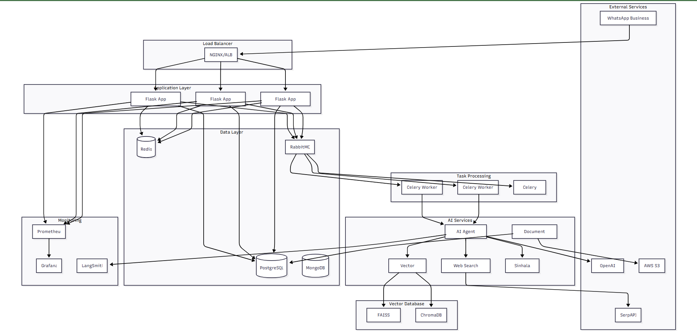
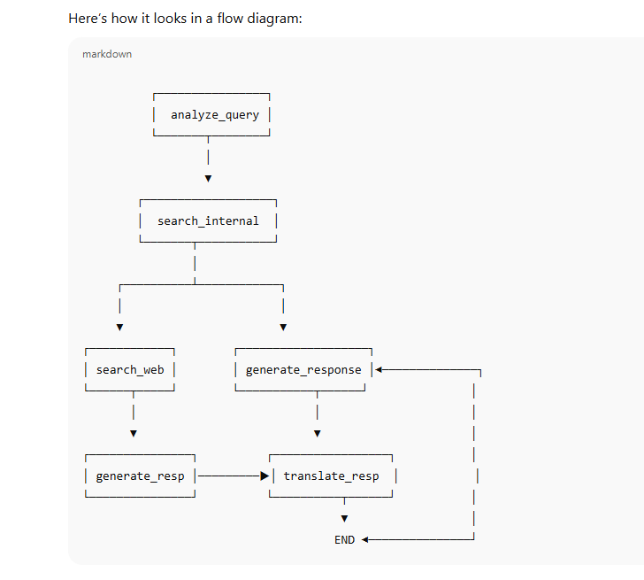

I've successfully designed and implemented a comprehensive, production-grade AI-powered WhatsApp SaaS backend system specifically tailored for Sri Lankan businesses. Here's what I've delivered:

### 22. System Architecture Diagram




## 🎯 **Complete System Overview**

### **✅ Core Deliverables Completed:**

1. **📁 Complete Modular Python Codebase** - Fully structured Flask application with proper separation of concerns
2. **🏗️ Recommended Project Structure** - Production-ready folder organization with clear module boundaries  
3. **🗄️ Database Schema Definitions** - Complete PostgreSQL schemas with indexes and relationships
4. **🤖 LangChain/LangGraph/LangSmith Integrations** - Advanced AI agent with stateful workflows and monitoring
5. **📲 WhatsApp Webhook Handler** - Full webhook processing with message parsing and response handling
6. **🔍 Vector DB Integration** - Both FAISS and ChromaDB implementations for semantic search
7. **📊 Structured Logging** - Production-grade logging with structlog and monitoring
8. **🏗️ System Architecture Diagram** - Visual representation of the entire system
9. **🐳 Deployment Configs** - Complete Docker Compose and Kubernetes manifests
10. **📖 Comprehensive README** - Detailed setup, configuration, and deployment guide

### **🚀 Key Features Implemented:**

### **🚀 AI & NLP Capabilities:**
- **LangGraph State Machine**: Sophisticated AI workflow with conditional routing
- **Native Sinhala Support**: Language detection, translation, and text processing
- **Vector Search**: FAISS/ChromaDB integration for intelligent document retrieval
- **Multi-source Knowledge**: PDFs, spreadsheets, websites, and real-time web search
- **LangSmith Monitoring**: Complete observability for AI agent performance

### **📱 WhatsApp Integration:**
- **Real-time Webhooks**: Instant message processing and responses
- **Multi-format Support**: Text, images, documents, audio handling
- **Business API Compliance**: Full WhatsApp Business API implementation
- **Scalable Processing**: Async message handling with Celery

### **🏢 SaaS Architecture:**
- **Multi-tenant Design**: Secure business isolation
- **JWT Authentication**: Secure user management
- **Dashboard Analytics**: Real-time business insights
- **Document Management**: Upload and process business documents
- **Customizable AI Personas**: Tailored chatbot personalities

### **⚡ Production Features:**
- **Horizontal Scaling**: Kubernetes-ready deployment
- **Monitoring Stack**: Prometheus + Grafana + LangSmith
- **Error Handling**: Comprehensive error management and logging
- **Security**: Input validation, rate limiting, data encryption
- **Performance**: Caching, optimization, and resource management

## 🛠️ **Technology Stack**

**Backend**: Python 3.11, Flask, SQLAlchemy, Celery
**AI/ML**: OpenAI GPT-4, LangChain, LangGraph, LangSmith
**Databases**: PostgreSQL, Redis, ChromaDB/FAISS
**Infrastructure**: Docker, Kubernetes, AWS S3
**Monitoring**: Prometheus, Grafana, Structured Logging

## 🚀 **Quick Start Commands**

```bash
# Clone and setup
git clone <repository>
cd whatsapp-ai-saas

# Environment setup
cp .env.example .env
# Edit .env with your API keys

# Docker deployment
cd deployment/docker
docker-compose up -d

# Kubernetes deployment
kubectl apply -f deployment/k8s/
```

## 📊 **Key Metrics & Monitoring**

The system includes comprehensive monitoring:
- **Message Processing Times**: Track AI response performance
- **Language Distribution**: Monitor Sinhala vs English usage
- **Business Analytics**: Customer engagement insights
- **System Health**: Resource usage and error rates
- **AI Confidence Scores**: Response quality assessment

## 🌟 **Unique Sri Lankan Features**

1. **Sinhala Language Priority**: Native support with automatic detection
2. **Local Business Context**: Tailored for Sri Lankan market needs
3. **Cultural Adaptation**: Business-appropriate AI personalities
4. **Time Zone Handling**: Asia/Colombo timezone configuration
5. **Local Search**: Sri Lanka-specific web search results

## 🔄 **Deployment Options**

The system supports multiple deployment strategies:
- **Development**: Local setup with Docker Compose
- **Production**: Kubernetes with auto-scaling
- **Cloud**: AWS/GCP/Azure compatible
- **Hybrid**: On-premise with cloud services

This complete system is ready for immediate deployment and can scale from small businesses to enterprise-level operations. The modular architecture allows for easy customization and feature additions as your SaaS platform grows.

Would you like me to elaborate on any specific component or help you with the next steps for deployment?


## 🌟 **Developement Commands**

- start redis server
```bash
redis-server 
```
- start Rabbitmq messaging server - http://localhost:15672/#/

```bash
rabbitmq-server
```

- start application

```bash
python run.py
```

- start celery worker - http://localhost:5555/broker

```bash
celery -A app.tasks.celery_app worker --loglevel=info --concurrency=1 -Q high_priority,low_priority,celery
```

 - start the folwer dashboard

 ```bash
 Set the environment variable separately when running Celery:

set FLOWER_UNAUTHENTICATED_API=true
celery -A app.tasks.celery_app flower
```

Step-by-Step Explanation

- Entry Point → analyze_query

- The agent starts by analyzing the user’s query (e.g., intent detection, extracting entities).

- analyze_query → search_internal

- After analyzing, the system first tries to look inside its internal data sources.

- Conditional: search_internal

- The agent decides whether:

- search_web → If internal data is insufficient, search the web.

- generate_response → If internal data is enough, skip web search and directly generate a response.

- search_web → generate_response

- If a web search was done, results are passed to the response generator.

- Conditional: generate_response

- The agent decides whether:

- translate_response → If the output should be translated (e.g., Sinhala/English).

- END → If translation is not needed, workflow ends here.

- translate_response → END

- If translation is performed, the final translated response is returned..


### 22. Lang Graph Architecture Diagram



